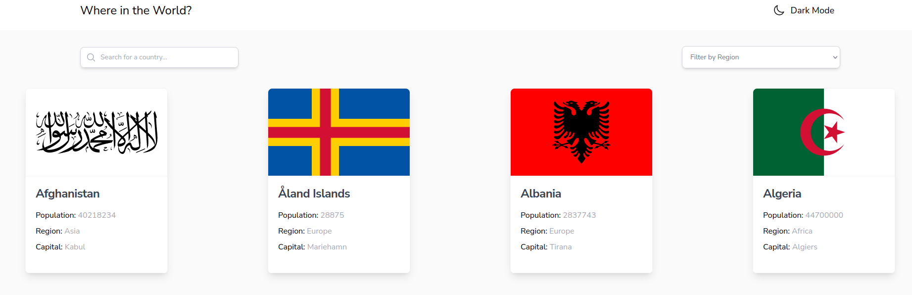
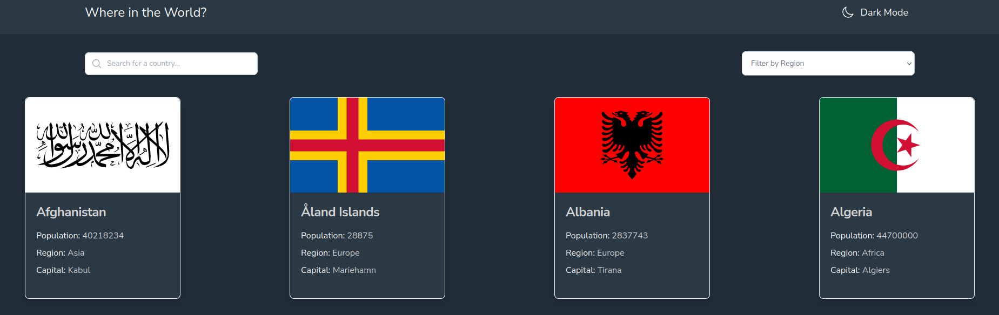
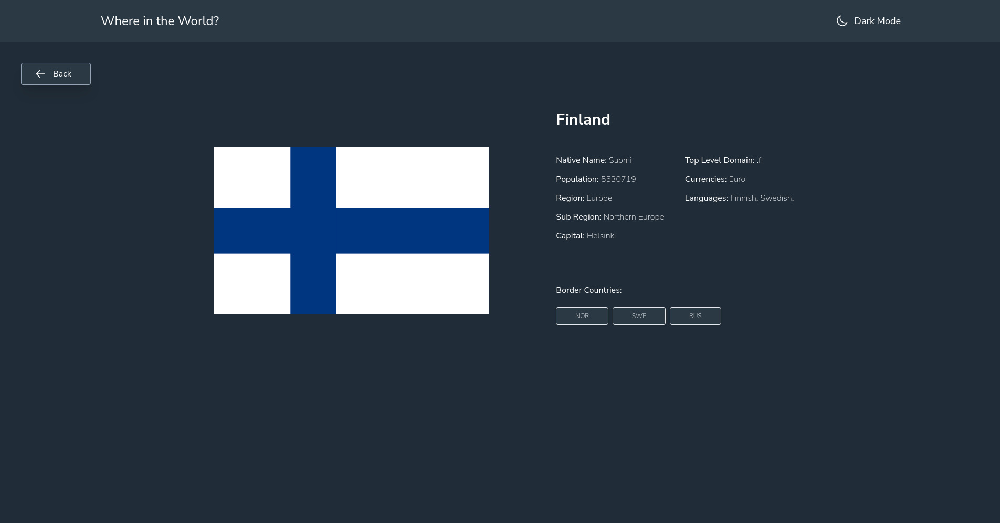
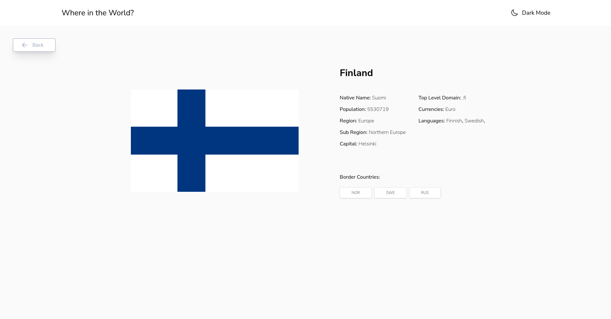

# REST Countries API with color theme switcher Challenge by Frontend Mentor
My challenge is integrating with the REST Countries API to pull country data and display it like in the designs.

I can use any JavaScript framework/library on the front-end, such as React or Vue. I also have complete control over which packages you use to make HTTP requests or style mine project.

My users should be able to:

  - See all countries from the API on the homepage
  - Search for a country using an input field
  - Filter countries by region
  - Click on a country to see more detailed information on a separate page
  - Click through to the border countries on the detail page
  - Toggle the color scheme between light and dark mode (optional)
    
## Built With

- Tailwind CSS
- React
- Redux Toolkit
- Axios
- React Router

## Full Screen View





## Instructions

First clone this repository.
```bash
$ git clone https://github.com/LuisSalas94/react-countries-api
```

Install dependencies. Make sure you already have [`nodejs`](https://nodejs.org/en/) & [`npm`](https://www.npmjs.com/) installed in your system.
```bash
$ npm install # or yarn
```

Run it
```bash
$ npm start # or yarn start
```

## Live Demo

[Live Demo Link]()


## Author 👤

- GitHub: [@LuisSalas94](https://github.com/LuisSalas94)
- LinkedIn: [Fernando Salas](https://www.linkedin.com/in/luisfernandosalasgave/)
- Medium: [Fernando Salas](https://medium.com/@luisfernandosalasg)

## 🤝 Contributing

Contributions, issues, and feature requests are welcome!
Feel free to check the [issues page](../../issues/).

## Acknowledgments 📚 
Original challenge by [Frontend Mentor](https://www.frontendmentor.io/challenges/url-shortening-api-landing-page-2ce3ob-G)

## Show your support

Give a ⭐️ if you like this project!

## Link of the Challenge

[Frontend Mentor](https://www.frontendmentor.io/challenges/rest-countries-api-with-color-theme-switcher-5cacc469fec04111f7b848ca)

## 📝 License

This project is [MIT](./MIT.md) licensed.